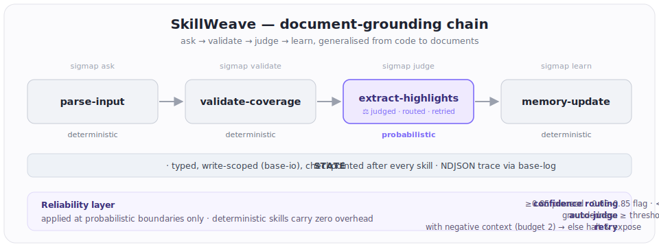

# SkillWeave

> A runtime — and emerging open standard — for composing LLM tasks from small, focused, testable micro-skills.

[](https://manojmallick.github.io/skillweave/)
[](https://github.com/manojmallick/skillweave/releases)
[](https://github.com/manojmallick/skillweave/actions/workflows/docs.yml)
[](LICENSE)
[](https://github.com/manojmallick/skillweave/actions/workflows/test.yml)
[](https://nodejs.org)

📖 **Docs:** [manojmallick.github.io/skillweave](https://manojmallick.github.io/skillweave/) · 📋 [Changelog](CHANGELOG.md) · 🗺️ [Roadmap](docs-vp/guide/roadmap.md)

**Latest: v2.0.0** — COMPOSE + OBSERVE: all composition patterns (sequential / parallel / map / reduce / conditional / loop + DAG) and a local-first observability layer (alerts, `skillweave visualise`, A/B). The v0.1 → v2.0 roadmap is complete. (Also ships the v1.3.0 MEMORY primitive.)

A runnable proof of the SkillWeave mechanics: a 4-skill chain that maps SigMap's
proven **ask → validate → judge → learn** pattern onto a new domain (documents),
with systematic non-determinism handling at the probabilistic boundary.



```
parse-input  →  validate-coverage  →  extract-highlights  →  memory-update
(sigmap ask)    (sigmap validate)     (probabilistic)         (sigmap learn)
                                      ↑ auto-judged · confidence-routed · retried
```

## What it proves

- STATE passes cleanly between skills (write-scope enforced by `base-io`).
- **Reliability layer** (v0.2.0) wraps probabilistic skills only:
  - **Confidence routing** — `≥0.85` proceed · `0.65–0.85` proceed + flag · `<0.65` retry.
  - **Auto-judge** — the boundary judge runs automatically after a probabilistic skill.
  - **Retry with negative context** — a failing skill is re-invoked (budget 2) with its
    prior output + the failure reason, then halts with full diagnostics if exhausted.
- Deterministic skills carry **zero** reliability overhead (no judge, no routing, no retry).
- Failures are **caught and surfaced** with full diagnostics — never silent.
- An NDJSON trace (SigMap `usage.ndjson`-compatible) and a STATE checkpoint are
  written after every skill / attempt.
- `memory-update` records each run locally and reports score trend over runs.

## Run it

```bash
npm install
npm start                            # happy path on the built-in sample document
npm start -- --doc ./mydoc.md        # run on your own document

# reliability demos:
npm start -- --inject lowconf        # low-confidence highlight → confidence routing RETRIES → recovers
npm start -- --inject hallucination  # ungrounded highlight → judge RETRIES → recovers
npm start -- --inject persistent     # always-ungrounded → retries exhausted → HALTS
npm start -- --inject coverage       # too-thin input → coverage assertion HALTS (deterministic)
```

Run `npm start` twice to see `memory-update` report the score trend across runs.
Run the tests with `npm test` (120 tests).

## CLI

The `skillweave` CLI loads a pipeline from YAML, resolves its skills from a registry,
and runs it — plus health grading and SigMap adapter access:

```bash
npm run cli -- doctor                    # readiness report — start here if you're new
npm run cli -- run pipelines/document-grounding.pipeline.yaml [--doc <path>] [--inject <mode>]
npm run cli -- validate pipelines/document-grounding.pipeline.yaml
npm run cli -- test parse-input          # run a single skill in isolation
npm run cli -- list                      # registered skills
npm run cli -- trace                     # latest NDJSON trace
npm run cli -- new pipeline my-flow      # scaffold a starter pipeline
npm run cli -- health                    # composite 0–100 health score + grade
npm run cli -- sigmap cost --suggest-tool "refactor auth security"   # → tier: powerful
npm run cli -- providers                 # provider/model capability table
npm run cli -- neutral docs/my-skill.md  # Neutral Skill Language check
npm run cli -- check-schemas             # validate the schema registry + pins
npm run cli -- check-permissions         # audit each skill's capabilities vs the policy
npm run cli -- verify --input ./doc.md   # run the sigmap-verify pipeline → structured verdict
npm run cli -- publish extract-highlights # grade + publish a skill to the tiered registry
npm run cli -- registry                  # list published skills by tier
npm run cli -- memory                    # what the pipeline learned from past runs
npm run cli -- visualise pipelines/document-grounding.pipeline.yaml  # ASCII/Mermaid diagram
```

Per-step `confidence_threshold` / `retries` in the YAML override a skill's defaults for
that step only. See the [CLI guide](docs-vp/guide/cli.md) and the
[SigMap adapters](docs-vp/guide/adapters.md) reference.

## The boundary judge (multi-LLM)

The boundary judge scores how well a probabilistic skill's output is *grounded* in
the raw input (did it fabricate or drop content?). In v0.2.0 it is **auto-inserted**
by the orchestrator after every probabilistic skill — there is no manual judge step.
It is provider-pluggable; the prompt/schema is model-neutral and runs on any provider.

Provider selection (first match wins):

| Condition | Provider | Model |
|---|---|---|
| `JUDGE_PROVIDER=anthropic\|gemini\|openai\|heuristic` | explicit override | — |
| `ANTHROPIC_API_KEY` set | Anthropic | `claude-opus-4-8` (adaptive thinking) |
| `GEMINI_API_KEY` / `GOOGLE_API_KEY` set | Google AI Studio | `gemini-2.5-flash` |
| `OPENAI_API_KEY` set | OpenAI | `gpt-4o-mini` |
| none | heuristic | offline token-overlap + fabrication penalty |

All three LLM providers return `{score, passed, confidence, failure_reason}` via
structured output, with per-skill cost computed from token usage. Any provider
error falls back to the heuristic, so the chain always completes.

```bash
# Google AI Studio (https://aistudio.google.com → "Get API key")
export GEMINI_API_KEY=...                 # or GOOGLE_API_KEY
npm start                                 # judge now runs on gemini-2.5-flash
GEMINI_MODEL=gemini-2.5-pro npm start     # override the model

# Anthropic
export ANTHROPIC_API_KEY=...
npm start                                 # judge runs on claude-opus-4-8

# OpenAI
export OPENAI_API_KEY=...
npm start                                 # judge runs on gpt-4o-mini
OPENAI_MODEL=gpt-4o npm start             # override the model

# Force a provider regardless of which keys are present
JUDGE_PROVIDER=openai npm start
```

## Layout

```
src/
  types.ts                 SKILL · PIPELINE · STATE · ASSERTION + reliability types
  orchestrator.ts          drives the chain; confidence routing + auto-judge + retry
  judge.ts                 multi-LLM boundary judge + offline heuristic fallback
  cli.ts                   skillweave CLI — run · validate · test · list · trace · new · health · sigmap
  registry.ts              skill name → implementation
  pipeline-loader.ts       parse + validate .pipeline.yaml → runnable Pipeline
  adapters/                SigMap CONTEXT/COST/OBSERVE wrappers (health grading)
  providers/               LLMProviderAdapter — anthropic/google/openai/ollama, profiles, executor, neutral validator
provider-profiles/         per-provider capability YAML
  schemas/                 versioned schema registry loader + differ + check
  security/                capability permissions · default-deny policy · guardWrite sandbox · redactSecrets
  catalog/                 tiered skill registry · 9-point quality gate · reputation · publish/install
  dx/                      skillweave doctor (readiness report) · did-you-mean suggestions
  events/                  EVENT primitive — typed EventBus · routed subscriptions
  triggers/                TRIGGER primitive — TriggerSpec · cron matcher · shouldActivate
  memory/                  MEMORY primitive — adaptive store · decay · conflict log · failure patterns
  compose/                 COMPOSE primitive — sequential/parallel/map/reduce/conditional/loop · dagLayers
  observe/                 OBSERVE primitive — checkAlerts · visualise (ASCII/Mermaid) · abTest
  sigmap-verify.ts         runSigMapVerify() → VerifyResult — SigMap's in-process verify entry
  index.ts                 public API barrel (runSigMapVerify · runPipeline · registry · security · adapters)
schemas/registry/          <name>@<version>.json schema store
  base/
    base-io.ts             STATE writes (scope-enforced) + checkpoints   [frozen]
    base-assert.ts         runs declared assertions; failure halts        [frozen]
    base-log.ts            NDJSON trace + execution summary               [frozen]
  skills/
    load-context.ts        deterministic — source raw_input from SigMap's CONTEXT
    parse-input.ts         deterministic — extract content blocks
    validate-coverage.ts   deterministic — assert coverage >= 0.70
    extract-highlights.ts  probabilistic — select highlights w/ confidence (judged + retried)
    memory-update.ts       deterministic — local NDJSON learning log
  run.ts                   built-in chain entry point
bin/skillweave.mjs         CLI launcher (tsx-backed)
pipelines/
  document-grounding.pipeline.yaml   runnable pipeline contract
  sigmap-verify.pipeline.yaml        SigMap's internal verify pipeline
scripts/                   sync-versions · run-reliability-benchmark
test/                      node:test suite (npm test)
```

Artifacts land in `traces/` (NDJSON + per-skill checkpoints) and
`.context/skillweave-memory.ndjson` (the learning log). Both are gitignored.
